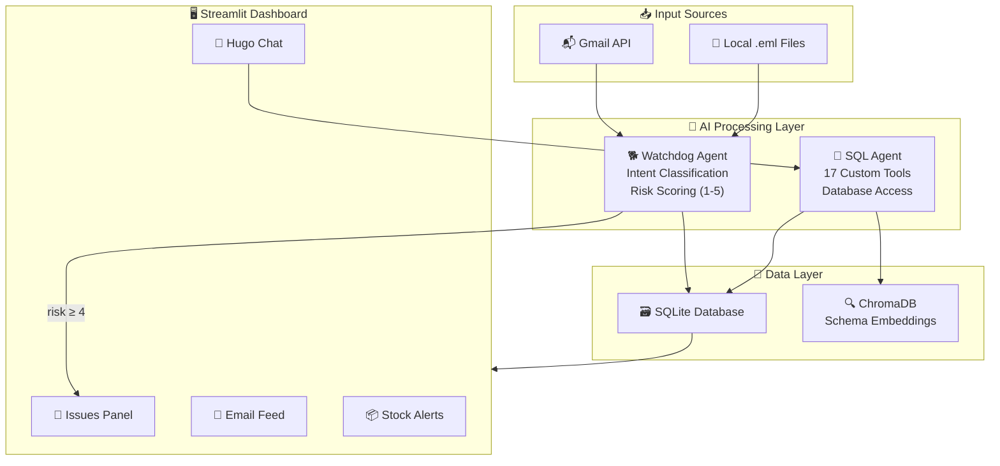
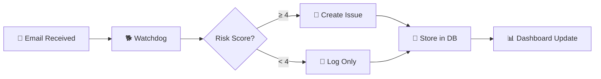
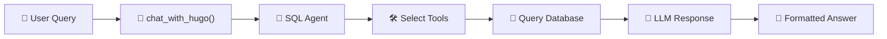
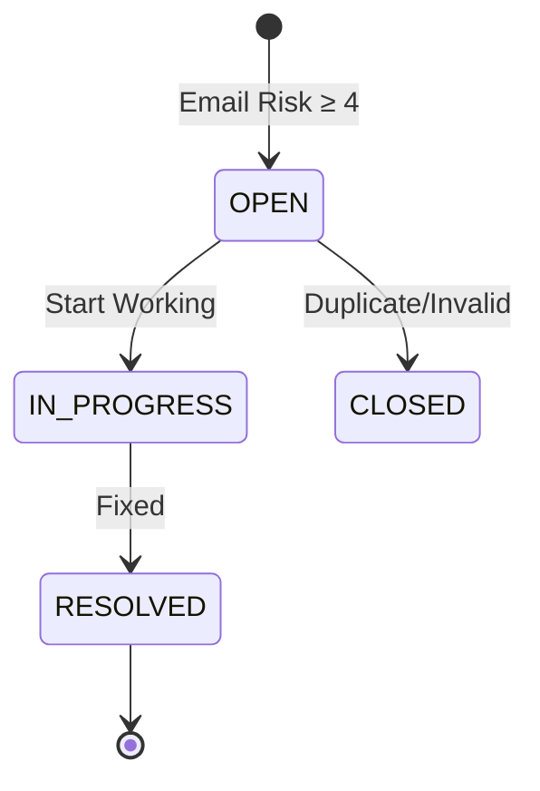

# Hugo AI - Complete System Documentation

## 🎯 Executive Summary

**Hugo** is an AI-powered procurement intelligence agent for Voltway, an electric scooter manufacturer. It monitors supplier communications, tracks inventory, automatically detects supply chain risks, and provides actionable insights through natural language interaction.

---

## 🏗️ System Architecture



---

## 🔄 Data Flow Diagrams

### Email Processing Flow



### Chat Flow



---

## 📁 Project Structure

```
Voltway_Hugo/
├── streamlit_app.py           # Main dashboard (PRIMARY ENTRY POINT)
├── voltway.db                 # SQLite database
├── google_credentials.json    # GCP service account
├── gmail_api_credentials.json # Gmail OAuth credentials
│
├── src/
│   ├── agents.py              # LLM agents, chat_with_hugo()
│   ├── tools.py               # check_fulfillment, safety_stock
│   ├── stock_tools.py         # Inventory tools (5 tools)
│   ├── email_tools.py         # Email tools (4 tools)
│   ├── issue_tools.py         # Issue tracking (6 tools)
│   ├── gmail_monitor.py       # Gmail OAuth2 + download
│   ├── rag_schema.py          # Schema embeddings (for scaling)
│   ├── ingest_specs.py        # OCR-based BOM extraction
│   ├── schemas.py             # Pydantic models
│   └── setup_db.py            # Database initialization
│
├── data/
│   ├── emails/                # Processed .eml files
│   ├── specs/                 # Scanned PDF manuals
│   ├── augment_data.py        # Data alignment script
│   ├── stock_levels.csv       # Inventory data
│   ├── material_orders.csv    # Purchase orders
│   ├── suppliers.csv          # Supplier database
│   └── sales_orders.csv       # Customer orders
│
└── docs/
    ├── EMAIL_SOP.md           # Email handling procedures
    └── SYSTEM_DOCUMENTATION.md
```

---

## 🧩 Technology Stack

| Layer | Technology | Purpose |
|-------|------------|---------|
| **LLM** | Gemini 2.5 Flash | AI backbone with structured output |
| **Framework** | LangChain | Agent framework with SQL capabilities |
| **Database** | SQLite | Primary data storage |
| **Embeddings** | VertexAI | Schema similarity search |
| **Vector Store** | ChromaDB | RAG for schema (scaling) |
| **Frontend** | Streamlit | Web dashboard |
| **Email** | Gmail API + OAuth2 | Real inbox monitoring |

---

## 🛠️ Available Tools (17 Total)

### 📦 Stock Awareness (5 tools)
| Tool | Description |
|------|-------------|
| `get_stock_status(part_id)` | Query stock for a specific part |
| `get_low_stock_alerts(threshold)` | Find parts below threshold |
| `get_stock_summary()` | Executive inventory overview |
| `get_stock_by_model(model)` | BOM-based stock check |
| `check_part_usage(part_id)` | Which BOMs use a part + demand |

### 📧 Email Awareness (4 tools)
| Tool | Description |
|------|-------------|
| `get_email_history(limit)` | Recent processed emails |
| `search_emails(keyword, intent)` | Search by keyword/intent |
| `get_email_summary(filename)` | Full email details |
| `get_emails_by_risk(min_risk)` | Filter high-risk emails |

### 🎫 Issue Tracking (6 tools)
| Tool | Description |
|------|-------------|
| `get_open_issues()` | All active issues |
| `get_issue_details(issue_id)` | Full issue info |
| `resolve_issue(id, notes)` | Close an issue |
| `create_issue(title, desc, severity)` | Manual creation |
| `update_issue_status(issue_id, status)` | Change status |
| `get_issue_summary()` | Dashboard statistics |

### 🔧 Operations (2 tools)
| Tool | Description |
|------|-------------|
| `check_fulfillment(date, model, qty)` | Build feasibility check |
| `calculate_lean_safety_stock(lead, demand)` | Statistical safety stock |

---

## 🎫 Issue Lifecycle



### Severity Levels
| Score | Severity | Example Triggers |
|-------|----------|------------------|
| 5 | 🔴 CRITICAL | Quality recall, production stop |
| 4 | 🟠 HIGH | Cancellation, discontinuation |
| 3 | 🟡 MEDIUM | Delay, partial shipment |
| 1-2 | 🟢 LOW | Price quotes, proposals |

---

## 📧 Email Intent Categories

| Intent | Auto-Actions |
|--------|--------------|
| **DELAY** | Check buffer stock, find alternates |
| **QUALITY_ALERT** | Set stock to HOLD, create critical issue |
| **DISCONTINUATION** | Recommend last-time-buy |
| **PRICE_CHANGE** | Calculate cost impact |
| **PROPOSAL** | Log for review |

---

## 🚀 Quick Start Commands

```bash
# 1. Setup database
python -c "from src.setup_db import create_sql_db; create_sql_db()"

# 2. (Optional) Extract BOMs from PDFs
python -m src.ingest_specs

# 3. (Optional) Build schema index
python -c "from src.rag_schema import build_schema_index; build_schema_index()"

# 4. Run dashboard
streamlit run streamlit_app.py
```

---

## ⚙️ Configuration

### Simulated Date (Testing)
```python
# src/tools.py
SIMULATED_TODAY = datetime.date(2025, 4, 10)  # For testing
SIMULATED_TODAY = None  # Production (real date)
```

### Rate Limiting
```python
# src/agents.py
MAX_RETRIES = 3      # Retries on 429 error
RETRY_DELAY = 10     # Seconds between retries
```

---

## 🔐 Security

- OAuth2 for Gmail (no password storage)
- Token-based authentication
- Credentials in JSON files (gitignored)
- No sensitive data in code

---

## 📈 Anti-Hallucination Measures

Hugo's prompt includes strict rules:
```
CRITICAL RULES:
- NEVER make up numbers. Say "I don't have that data."
- ALWAYS use check_part_usage(part_id) BEFORE claiming demand quantities
- If a part isn't in any BOM, say so clearly
```

---

*Last Updated: December 2024*
